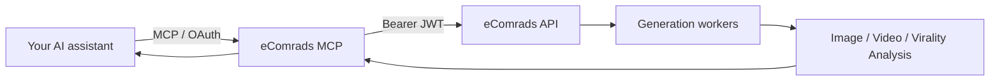

# eComrads MCP

**Generate scroll-stopping product ads, photoshoots, and videos — straight from your AI assistant.**

eComrads MCP is a [Model Context Protocol](https://modelcontextprotocol.io) server that connects Claude, ChatGPT, Cursor, and any MCP‑compatible client to the [eComrads](https://ecomrads.com) creative engine. Upload a product photo and ask for a photoshoot, a UGC video, a static ad, or a Virality Analysis — the assistant does the rest.

> One image in → studio-grade creative out. No design tools, no prompt-guessing.

---

## What you can do

| Capability | Tool | What it does |
|------------|------|--------------|
| **Upload** | `upload` | Send an image (URL or paste) and get back a public link to use in any creative tool. |
| **Product photoshoot / edits** | `edit_product_photo` | Relight, restyle, swap backgrounds, dress a model, or generate from a prompt. |
| **Product video** | `product_video` | Animate a still product image into motion. |
| **UGC-style video** | `ugc_video` | Creator-style, scripted videos with an actor/avatar. |
| **Static ad creative** | `static_product_ad` | Slides / carousel-ready static ads. |
| **Virality Analysis** | `analyze_ad` | Analyze an ad (image or video) and predict performance with a scored breakdown. |
| **Competitor spy** | `competitor_spy_meta_library` | Research live & historical ads in the Meta Ads Library. |
| **Recreate a winning ad** | `recreate_similar_ad` | Recreate a competitor-style ad using your product. |
| **Job status** | `check_generation` | Poll a generation until it finishes (the assistant handles this for you). |

All creative work runs **asynchronously**: a tool returns a job, and the assistant polls until the result URL is ready — then shows you the image or video.

---

## How it works



- **The MCP server is a thin client.** All generation, credits, and AI providers live in the eComrads backend.
- **Auth** uses your eComrads account (same sign-in as the web app), so your usage and credits are tied to you.
- **Outputs are engineered, not guessed.** Prompts are expanded into a structured creative brief before generation (see [SKILLS.md](./SKILLS.md)).

---

## Connect

Point your MCP client at the hosted server:

```
https://mcp.ecomrads.com/mcp
```

1. Add a new connector / custom MCP server in your client and paste the URL above.
2. When prompted, **authorize in your browser** — sign in with your eComrads account (email or Google) and approve the connection.
3. The eComrads tools appear in your assistant. Upload a product image and start creating.

> Need an account? Sign up at [ecomrads.com](https://ecomrads.com). Generations consume your plan credits.

---

## Run it yourself (self-host)

```bash
git clone <your-fork-url> ecomrads-mcp
cd ecomrads-mcp
npm install
cp .env.example .env   # fill in the values below
npm run build
npm start
```

### Environment

| Variable | Required | Purpose |
|----------|----------|---------|
| `ECOMRADS_API_BASE_URL` | yes | Base URL of the eComrads API (no trailing slash). |
| `IMGBB_API_KEY` | yes (for `upload`) | Key for the image host that backs the `upload` tool. Get one at [api.imgbb.com](https://api.imgbb.com/). |
| `ECOMRADS_ACCESS_TOKEN` | single-user only | An eComrads session token for local/dev use. |
| `MCP_PUBLIC_URL`, `SUPABASE_URL`, `SUPABASE_ANON_KEY` | multi-user | Enable browser OAuth sign-in for connectors. |
| `PORT`, `MCP_HOST`, `MCP_ALLOWED_HOSTS` | optional | HTTP listener + host allowlist for remote connectors. |

> **Never commit secrets.** `.env` is git-ignored; only `.env.example` (placeholders) belongs in the repo. Use end‑user tokens — never service-role keys.

---

## Install Skills

This folder is now publish-ready as a skills repo. Push **`~/Desktop/ecomrads-mcp-public`** to GitHub, then users can install with:

```bash
npx skills add <github-owner>/<repo>
```

or in Claude Code:

```text
/plugin marketplace add <github-owner>/<repo>
/plugin install ecomrads@ecomrads
```

The skill folders are at the repo root (`ecomrads-product-photoshoot/`, `ecomrads-ugc-video/`, etc.), matching the Higgsfield-style layout.

## Get great results — Agent Skills

The quality of generations depends on how prompts are constructed. This repo ships a portable **skills bundle** in **[`mcp-skills/`](./mcp-skills)** — a set of structured agent skills (one folder each, with a `SKILL.md`) that teach the assistant to:

- act as a **creative director**, not a prompt-spammer,
- expand short requests into a structured, layered creative brief,
- pick sensible defaults (aspect ratio, model, resolution),
- run the upload → generate → deliver flow cleanly, and
- show you the final media URL, not internal job chatter.

| Skill | For |
|-------|-----|
| `ecomrads-product-photoshoot` | Product images & edits (studio, lifestyle, hero, try-on, restyle) |
| `ecomrads-product-video` | Image-to-video animation of a product (no presenter) |
| `ecomrads-ugc-video` | UGC creator video — testimonial, unboxing, how-to, vlog |
| `ecomrads-static-ads` | Static / carousel ad creatives + recreate a competitor ad |
| `ecomrads-virality-analysis` | Analyze a finished ad (image or video) and predict performance |
| `ecomrads-competitor-spy` | Meta Ads Library research |

Shared behavior lives in [`mcp-skills/AGENTS.md`](./mcp-skills/AGENTS.md) and the prompt system in [`mcp-skills/references/prompting.md`](./mcp-skills/references/prompting.md). The `mcp-skills/` folder is self-contained — drop it into any skills directory or publish it on its own.

---

## Project layout

```
.
├── README.md          # this file
├── mcp-skills/        # portable agent skills bundle (move/publish on its own)
│   ├── README.md          # skills index + install
│   ├── AGENTS.md          # shared behavior rules
│   ├── COOKBOOK.md        # copy-paste recipes
│   ├── references/        # prompting, upload, jobs
│   └── ecomrads-*/        # one folder per skill (SKILL.md)
├── .env.example       # configuration template (no secrets)
└── src/               # MCP server (HTTP client + tool definitions)
```

---

## License

MIT — see `LICENSE`.

> eComrads, the eComrads API, and generation models are operated by eComrads. This MCP server is the open client surface; it does not include backend business logic.
# skills
